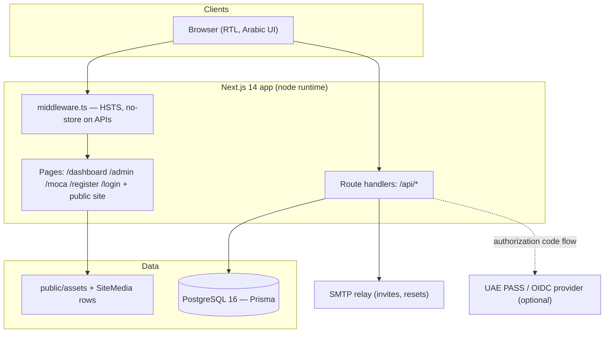
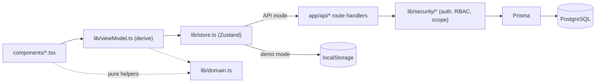
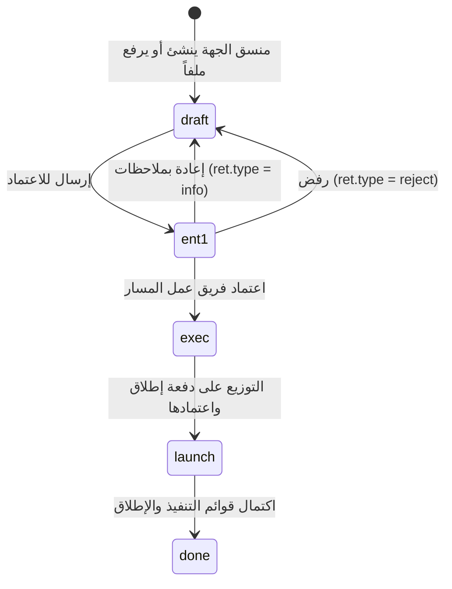
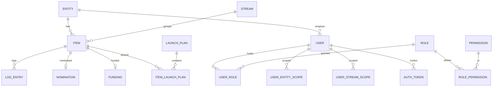
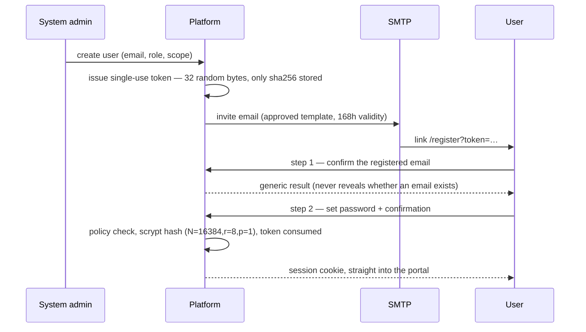

# GDCP — Technical Design Document

**Platform:** المنصة الحكومية لتخطيط ومتابعة مشروع الذكاء الاصطناعي المساعد
(Agentic AI for UAE Government — planning & follow-up portal)
**Repository branch:** `v4-portal-merged` (IT / staging build)
**Stack:** Next.js 14 (App Router, TypeScript) · PostgreSQL 16 · Prisma ORM · Zustand
**Audience:** the IT team taking the system over — developers, DBAs, integrators.

This document is the reference map of the system: what each part is, where it
lives, and how business vocabulary maps to code identifiers and database
columns. It complements, and does not replace, the operational documents:

| Document | Covers |
| --- | --- |
| `DEPLOYMENT.md` | Install, build, run, environment setup |
| `GO-LIVE.md` | Release package and go-live checklist |
| `HANDOVER.md` | What ships in the package, acceptance list |
| `API_REFERENCE.md` | Endpoint list added in the hardening pass |
| `RBAC_MATRIX.md` | Roles and permissions reference |
| `DATA_ISOLATION.md` | Entity/stream scoping rules |
| `MIGRATION_STARTUP_BEHAVIOR.md`, `FIRST_BOOT_MIGRATION.md`, `MANUAL_MIGRATION.md` | Migration behaviour on boot and by hand |
| `docs/roles-pages-access.md` | Page-by-page access per role |

---

## 1. System overview

### 1.1 What the system does

Federal entities inventory their processes, strategic tasks and government
services; they assess each one for AI transformation; the project stream teams
and the national committee review and approve; approved entries are placed into
launch batches (دفعات الإطلاق) and then followed up through execution.

Four working populations share one dataset and one workflow:

- **منسق المسار في الجهة الاتحادية** (`entity_coordinator`) — fills and submits the entity's inventory.
- **فريق عمل المسار في المشروع** (`stream_owner`) — reviews and approves within a stream, may upload on behalf of an entity.
- **اللجنة الوطنية للذكاء الاصطناعي المساعد** (`ai_committee`) — second-gate approval, funding, cross-entity views.
- **مشرف النظام / مدير البرنامج** (`system_admin`, `program_admin`) — users, roles, entities, streams, site content.

Two self-contained modules sit beside the main workflow:

- **وزارة شؤون مجلس الوزراء (MOCA)** — the ministry's own inventory structure (units/sectors, its own form), reviewed by the national committee. Separate tables, separate store, shared UI language.
- **المشاريع الاستراتيجية** — project definitions and member forms, owned by project leads.

### 1.2 Two builds from one repository

| | IT / staging build | Demo build |
| --- | --- | --- |
| Flags | `NEXT_PUBLIC_DATA_MODE=api`, `NEXT_PUBLIC_AUTH_PROVIDER=uaepass` | `NEXT_PUBLIC_DEMO_MODE=1`, `NEXT_PUBLIC_DEMO_DATA=1`, `NEXT_PUBLIC_BASE_PATH=/Transformation` |
| Data | PostgreSQL through `/api/*` | Bundled seed + `localStorage` |
| Auth | Email + password (invite/activation), UAE PASS/OIDC available behind a flag | Mock sign-in, role switcher in the header |
| Build | `npm run build` → `next start` | `npm run export` → static files |
| Branch | `v4-portal-merged` | `demo-after-changes-2` |

Demo-only behaviour (role switcher, seeded data, mock sign-in) is gated by
`NEXT_PUBLIC_DEMO_MODE` and never reaches the IT package.

### 1.3 Context



---

## 2. Repository map

```text
app/                 Next.js App Router: pages + /api route handlers
  api/…              REST endpoints (see §7)
  dashboard/         main workspace (all workflow roles)
  admin/             admin console page shell
  moca/              ministry workspace page shell
  register/          account activation / password reset screen
components/          UI (no data access; everything through the store or props)
  Dashboard.tsx      workspace shell: nav, pages, filters, tables      (~4.4k lines)
  AdminConsole.tsx   users, roles, entities, coordinators, site content (~2.6k)
  CreatePanel.tsx    create/edit + bulk upload panel                    (~2.2k)
  MocaWorkspace.tsx  ministry workspace + MocaSections (embedded)       (~2.1k)
  DetailPanel.tsx    the structured entry detail view
  Overlays.tsx       modals, drawers, confirmations
  RowActions.tsx     unified row actions (≤3 inline, rest under «⋮»)
  StrategicProjects.tsx, PublicSite.tsx, Login.tsx, Register.tsx, …
lib/
  domain.ts          domain constants + pure logic (streams, fields, workflow) (~1.9k)
  store.ts           Zustand store: state, actions, API sync, import      (~3.3k)
  viewModel.ts       derived view-model consumed by components            (~3.1k)
  export.ts          Excel/PPT templates and report generation
  moca.ts / mocaStore.ts / mocaExcel.ts   ministry module
  entities.ts / entitiesOfficial.ts / svcCatalog.ts   entity register + service catalogue
  security/          auth, session, RBAC, scoping, audit, password, invite, mailer
  prisma.ts          Prisma client singleton
prisma/
  schema.prisma      data model (§6)
  migrations/0001…0021   ordered SQL migrations
  seed.ts            idempotent catalogue seeding
scripts/             static export, startup migration, smoke test, SQL samples
docs/                handover packs, roles/access matrices, change logs
```

**Rule of thumb:** components never touch Prisma; route handlers never import UI;
`lib/domain.ts` holds no React and no I/O, so it is safe to import anywhere.

---

## 3. Architecture

### 3.1 Layers



- **`lib/domain.ts`** — single source for streams, field specs per stream, option
  lists, workflow states and every derivation rule (priority, missing-field
  checks, period parsing). Change business rules here, not in components.
- **`lib/store.ts`** — the only place that mutates state. Every action updates
  local state, appends a log entry, and (API mode) persists.
- **`lib/viewModel.ts`** — turns state into everything the screens render:
  filtered lists, counters, chips, permissions-by-role flags. Components stay
  declarative.
- **`lib/security/*`** — server-side gatekeeping: session parsing, permission
  assertions, entity/stream scope, audit logging.

### 3.2 State and persistence

The portal keeps a **workspace blob** (items, launch plans, logs, program
config, site content) plus normalised tables for everything security-relevant.

- **Blob path:** `GET /api/state` → store hydration; mutations → `PUT /api/state`
  (fire-and-forget). The endpoint is scope-aware: a global role reads/writes the
  blob whole; a scoped role receives only its slice, and its writes are **merged**
  so it can never clobber or read another entity's data (`app/api/state/route.ts`,
  `scopeOf()`).
- **Normalised path:** users, roles, permissions, scopes, entities, streams,
  audit logs, MOCA entries, strategic-project forms, AI assistants and auth
  tokens are ordinary relational tables, reached through their own endpoints.

This hybrid is deliberate: it preserved the approved prototype's rich item shape
while putting identity, authorisation and auditing on a normalised, enforceable
base. `AppState` is the blob table; `Item` and friends exist for reporting and
for endpoints that must enforce row-level scope.

### 3.3 Request lifecycle (server mode)

1. `middleware.ts` sets HSTS on every response and `no-store` on `/api/*`
   (except `/api/media/:id` and `/api/site-content`).
2. The handler calls `requireAuthUser(req)` — verifies the signed session
   cookie, loads the user with roles, permissions and scopes; throws 401 otherwise.
3. `assertPermission(user, 'items:update')` — 403 on failure.
4. `buildItemScopeWhere(user)` / `assertItemAccess(...)` — restricts rows to the
   caller's entity and streams; global roles bypass.
5. Mutation runs, `writeAuditLog(...)` records actor, action, target, IP.
6. Response is JSON; errors go through `handleApiError` → `jsonError` with
   user-facing Arabic messages that never leak internals.

---

## 4. Domain model

### 4.1 Streams (المسارات)

Defined in `lib/domain.ts → PATHS`; the DB mirror is the `streams` table.

| id | Arabic name | Entry unit | Extra structure |
| --- | --- | --- | --- |
| `ops` | العمليات والدعم المؤسسي | العملية الرئيسية + أنشطة فرعية | `operation` |
| `strategy` | العمل الحكومي الاستراتيجي | المهمة + أنشطة، مع المحور | seven محاور |
| `services` | الخدمات الحكومية | الخدمة + الخدمة الفرعية | service catalogue |

Two further programme streams (technology, capabilities) exist for
head-of-stream assignment only; they carry no inventory inside the platform.

### 4.2 The inventory entry

One row in `Item` (and one object in the blob). Shared identity fields plus a
per-stream field set declared in `STREAM_FIELDS`, and a repeated **activity**
structure (`activities` JSON / `sub_activities`) — one Excel row per activity,
mirrored back into the parent entry.

Derived, never stored as input:

| Derived value | Rule (in `lib/domain.ts`) |
| --- | --- |
| أولوية الاختيار (strategy) | `stgPriority()` — matrix of transform score × readiness × impact |
| أولوية الاختيار (services) | `svcPriority(usageIntensity, complexity, readinessLevel)` |
| أولوية التحول للذكاء الاصطناعي المساعد (نعم/لا) | `activityTransformYes(path, activity)` |
| نسبة الإنجاز | `stageWeight()` per workflow state |
| الحقول الناقصة | `missingFieldsOf()` / `activityMissing()` |
| دفعة الإطلاق من فترة التحويل | `firstMonthOf()` → `activityBatch()` |

### 4.3 Workflow

`WfState` in `prisma/schema.prisma`, labels in `WFMETA`.



- `pm1`/`pm2` are legacy states coerced by `wfOf()`; do not write them.
- A returned entry keeps `ret` (`type`, `from`, `note`) and shows as «للتعديل»
  or «تم الرفض» rather than «مسودة».
- Funding and nomination are gated by `isEntityApproved()` (`exec` and later).
- Team uploads on behalf of an entity land as drafts flagged `teamUp` and wait
  for the entity coordinator's confirmation.

### 4.4 Launch batches (دفعات الإطلاق)

`ExecBatch` rows carry the approved batch names and periods; items reference the
batch **by name** (`exec_batch`) deliberately, so renaming a batch does not
orphan rows. `TBD_BATCH` («للتحديد بعد الدراسة») is the parking batch.

### 4.5 Entity register

`lib/entitiesOfficial.ts` is the approved register (43 in-scope entities +
وزارة شؤون مجلس الوزراء, plus entities pending inclusion, created disabled).
`ENTITY_ALIASES` maps legacy spellings to the approved name; `officialEntityName()`
and `legacyNamesOf()` are the only sanctioned way to reconcile names. At boot,
`ensureEntityRegister()` renames aliased rows, merges duplicates (moving items,
users, services and scopes), creates missing ones and deactivates names outside
the register — idempotent, non-destructive.

In the server build the live list comes from the database
(`GET /api/entities` → `store.entityList`); the register file is the seed value
and the demo build's list.

---

## 5. Terminology map (business ↔ code ↔ database)

The table every integrator asks for.

| Arabic term | Code identifier | DB column / table | Where it shows |
| --- | --- | --- | --- |
| الجهة الاتحادية | `entity`, `entityName`, `entityId` | `entities`, `items.entity_id` | filters, headers, admin |
| المسار | `path` (UI) / `streamId` (API) | `streams.id`, `items.stream_id` | nav, filters |
| المدخل (حصر) | `Item` | `items` | inventory tables |
| النشاط الفرعي | `activities[]`, `subActivities` | `items.activities` (JSON) | create panel, detail |
| الحالة (سير العمل) | `wf`, `wfOf()`, `WFMETA` | `items.wf` (`wf_state`) | status chips |
| إعادة بملاحظات / رفض | `ret.type = info \| reject` | `items.ret_type/ret_from/ret_note` | row actions, banners |
| قابلية التحول | `transformScore` / `transformability` | `items.transformability` | forms, filters |
| الجاهزية للتحول | `readinessLevel` / `readiness` | `items.readiness` | forms, filters |
| أولوية التحول | `transformPriority` (`مرتفعة/متوسطة/منخفضة/ليست ذات أولوية`) | `items.transform_priority` | ops forms, filters |
| هل سيتم تحويل العملية؟ | `willTransform` (نعم/لا) | inside `items.activities` | ops forms, filters |
| فترة التحويل | `transformPeriod` | inside `items.activities` | forms, batch placement |
| دفعة الإطلاق | `execBatch` | `items.exec_batch` → `exec_batches.name_ar` | batches pages |
| خطة الإطلاق | `LaunchPlan` | `launch_plans`, `item_launch_plans` | batches pages |
| اسم مساعد الذكاء الاصطناعي | `AiAssistant` | `ai_assistants`, `item_activity_assistants` | inventory column |
| الترشيح للتمويل | `Nomination` | `nominations` | committee pages |
| التمويل | `Funding`, `FundingCancellation` | `funding`, `funding_cancellations` | committee pages |
| المستخدم / الدور / الصلاحية | `User`, `Role`, `Permission` | `users`, `roles`, `permissions`, `user_roles`, `role_permissions` | admin console |
| نطاق الجهة / نطاق المسار | `UserEntityScope`, `UserStreamScope` | `user_entity_scopes`, `user_stream_scopes` | admin console |
| منسق المسار في الجهة | role `entity_coordinator` + stream scope | `user_roles` + `user_stream_scopes` | entities tab → «منسقو المسارات» |
| سجل التدقيق | `AuditLog` | `audit_logs` | admin → سجل التغييرات |
| وزارة شؤون مجلس الوزراء — مدخل | `MocaEntry` | `moca_entries` (form fields in `fields` JSON) | `/moca`, committee pages |
| وزارة شؤون مجلس الوزراء — حالة استخدام | `MocaUseCase` | `moca_use_cases` | use-cases pages |
| مشروع استراتيجي | `ProjDef`, `ProjForm` | `proj_defs`, `proj_forms` | strategic projects pages |

**MOCA priority, explicitly:** the ministry's form field
«أولوية التحول للذكاء الاصطناعي المساعد» stays **نعم/لا** exactly as in the
ministry's workbook (`MOCA_PRIORITY`), and that is what the table column and the
new priority filter show. The ordinal indicator computed from قابلية × جاهزية ×
أثر − تعقيد (`mocaPriorityScore()`) is labelled «التقييم المحسوب للأولوية» and
appears in the detail drawer only. The other streams keep their own
مرتفعة/متوسطة/منخفضة scale — the two scales are intentionally different and must
not be merged.

---

## 6. Data model

### 6.1 Model groups

| Group | Models |
| --- | --- |
| Catalogue | `Entity`, `Stream`, `ServiceCatalog`, `ProgramPhase`, `ExecBatch`, `Setting` |
| Inventory | `Item`, `ExecChecklistItem`, `SubMilestone`, `Launch`, `ItemLaunch`, `LogEntry` |
| Launch planning | `LaunchPlan`, `ItemLaunchPlan` |
| Decisions | `Nomination`, `Funding`, `FundingCancellation` |
| Identity & access | `User`, `Role`, `Permission`, `UserRole`, `RolePermission`, `UserEntityScope`, `UserStreamScope`, `RoleAssignmentRule`, `AuthToken` |
| Legacy assignment | `EntityRep`, `StreamOwner` |
| Observability | `AuditLog`, `Notification` |
| Compatibility | `AppState` (the workspace blob), `SiteMedia` |
| MOCA | `MocaEntry`, `MocaUseCase` |
| Strategic projects | `ProjDef`, `ProjForm`, `ProjMemberLead` |
| AI assistants | `AiAssistant`, `ItemActivityAssistant` |

Conventions: `snake_case` columns via `@map`, `cuid()` ids on newer models,
string ids on ported ones, `created_at`/`updated_at` everywhere, enums
`wf_state` and `item_type` in the database.

### 6.2 Core relations



### 6.3 Migrations

`0001` … `0021`, applied in order with `prisma migrate deploy`
(`npm run db:migrate`). Recent ones worth knowing:

| Migration | Adds |
| --- | --- |
| `0012_rbac_hardening_v3` | roles, permissions, scopes, audit logs |
| `0015_moca_and_strategic_projects` | ministry and strategic-project tables |
| `0017_ai_assistants` … `0019_assistant_link_to_state_items` | AI assistant catalogue and per-activity links |
| `0020_entity_register` | approved entity register fields |
| `0021_password_auth` | `users.password_hash`, lockout counters, `auth_tokens` |

`scripts/prisma-startup-migrate.mjs` applies pending migrations at container
start; see `MIGRATION_STARTUP_BEHAVIOR.md` for the exact behaviour and the
manual alternative.

Seeding (`npm run db:seed`) is **idempotent**: `ensureRbacCatalog()` upserts
roles/permissions, `ensureEntityRegister()` reconciles the entity register, and
catalogue rows are upserted — re-running changes nothing.

---

## 7. Security design

### 7.1 Authentication

Two providers, selected by `AUTH_PROVIDER` / `NEXT_PUBLIC_AUTH_PROVIDER`:

**Email + password (current default for go-live).**



- Passwords: `scrypt` from Node's own crypto, per-password random salt,
  timing-safe comparison (`lib/security/password.ts`). Policy: ≥10 characters,
  letter + digit, no spaces, no common passwords, no long runs, no sequences,
  minimum character variety.
- Lockout: `LOGIN_MAX_ATTEMPTS` (5) failures → `LOGIN_LOCK_MINUTES` (15).
- Reset: the admin can re-issue an invite with `{purpose:'reset'}`; issuing a
  new token invalidates the user's previous unused tokens.
- Rate limiting on auth endpoints via `lib/security/rate-limit.ts` (per IP).

**UAE PASS / OIDC** (`lib/security/oidc.ts`) — authorization-code flow, kept
wired and configurable but hidden in the UI until the integration is enabled.

**Session:** a signed, non-encrypted token `base64url(payload).HMAC-SHA256`
in an HttpOnly cookie (`SESSION_COOKIE_NAME`, default `aigp_session`), TTL from
`SESSION_TTL_SECONDS` (default 8h), `Secure` in production. No server-side
session store; revocation is by disabling the user (checked on every request).

### 7.2 Authorisation

- **Roles → permissions** are data (`roles`, `permissions`, `role_permissions`),
  seeded from `RBAC_ROLES` / `ROLE_PERMISSION_MATRIX` in
  `lib/security/rbac-catalog.ts`. Eleven roles, 37 permissions of the form
  `resource:action`.
- **`system_admin` is a super-role** (`isSuperAdmin`) and bypasses permission
  checks; everything else is evaluated against the matrix.
- **Scopes** narrow rows: `user_entity_scopes` and `user_stream_scopes`.
  `canAccessAllEntities`, `isStreamGlobalRole`, `isEntityGlobalRole` decide the
  shape; `buildItemScopeWhere` turns it into a Prisma `where`.
- **Bootstrap:** `BOOTSTRAP_ADMIN_EMAILS` grants the first administrator on
  first sign-in and self-heals the RBAC catalogue if the database was migrated
  without seeding.

### 7.3 Hardening

HSTS and `no-store` in `middleware.ts`; CSP, `X-Frame-Options: DENY` and
`Referrer-Policy` for every path in `next.config.mjs`;
audit log on every privileged mutation (actor, action, target, IP, timestamp);
Arabic user-facing errors with no internal detail; uploads stored as rows
(`SiteMedia`) with fresh ids per replacement; no secrets in client bundles
(only `NEXT_PUBLIC_*` flags reach the browser).

---

## 8. API surface

All handlers are `runtime = 'nodejs'`, `dynamic = 'force-dynamic'`, JSON in/out,
session cookie required unless noted.

| Area | Endpoints | Notes |
| --- | --- | --- |
| Auth | `GET /api/auth/login`, `GET /api/auth/me`, `POST /api/auth/logout`, `POST /api/auth/register`, `POST /api/auth/password`, `GET /api/auth/uaepass/login`, `GET /api/auth/uaepass/callback`, `GET /callback` | register: `step: verify \| complete`; password: login/forgot |
| Workspace blob | `GET/PUT /api/state` | scope-aware read, merge-on-write |
| Items | `GET/POST /api/items`, `GET/PATCH/DELETE /api/items/[id]`, `POST /api/items/[id]/submit\|approve\|reject\|return` | permission + scope enforced per call |
| Launch planning | `GET/POST/PATCH /api/launch-plans` | |
| Decisions | `/api/nominations`, `/api/funding` | committee permissions |
| Entities | `GET /api/entities` (active register), `GET/POST/PATCH/DELETE /api/admin/entities`, `POST /api/admin/entities/bulk`, `GET/PUT/DELETE /api/admin/entities/coordinators` | delete guarded: items/users block, services need `withServices=1` |
| Admin | `/api/admin/users…`, `/api/admin/roles`, `/api/admin/permissions`, `/api/admin/role-rules`, `/api/admin/streams`, `/api/admin/audit-logs`, `POST /api/admin/users/[id]/invite\|enable\|disable`, `/api/admin/users/[id]/roles`, `/api/admin/users/[id]/scopes` | `users:*`, `roles:*`, `settings:*` |
| MOCA | `GET /api/moca/entries`, `GET /api/moca/use-cases`, `POST /api/moca/sync` | reads are scoped by unit; all writes go through `sync` |
| Strategic projects | `/api/projects/defs`, `/api/projects/forms`, `/api/projects/members`, `/api/projects/member-leads`, `/api/projects/lead-identity` | |
| Content & misc | `/api/site-content`, `/api/media`, `/api/media/[id]`, `/api/contact`, `/api/svc-catalog`, `/api/ai-review`, `/api/team/register` | media and site-content are the only cacheable APIs |
| Ops | `GET /api/health`, `GET /api/ready` | for probes |

---

## 9. Modules

### 9.1 Ministry module (MOCA)

- **Structure:** units and sectors (`MOCA_UNITS`), not entities and streams.
- **Form:** `MOCA_FIELDS` in three groups — البيانات العامة, بيانات الأتمتة والكثافة والحجم,
  التحول للذكاء الاصطناعي المساعد — stored in `moca_entries.fields` (JSON) because the
  ministry's workbook differs from the stream templates.
- **Workflow:** coordinator drafts → submits → national committee approves,
  returns with notes, or rejects. Batch placement has its own approval cycle
  (`batch_wf`).
- **UI:** `MocaWorkspace` renders the ministry page at `/moca`; the same
  components are exported as `MocaSections` and embedded in the committee
  dashboard, so both places share one structure (KPIs → filters + search →
  table → side detail drawer). Access scoping lives in
  `lib/security/moca-access.ts`.
- **Import:** `lib/mocaExcel.ts` reads the ministry template; percentages are
  parsed from real percent cells or from the first number in the text (a range
  like «40 – 60%» yields 40).

### 9.2 Strategic projects

`ProjDef` (definition, lead, period) and `ProjForm` (member submissions), with
`ProjMemberLead` binding members to their lead. Access rules in
`lib/security/proj-access.ts`; UI in `components/StrategicProjects.tsx`.

### 9.3 Admin console

Users (create, edit, enable/disable, invite, reset password, bulk upload with
duplicate skipping), roles and permissions, role-assignment rules, entities
(CRUD, bulk upload, per-stream coordinators), streams, site content, contact
inbox and the audit log.

### 9.4 Public site

`/`, `/about`, `/library`, `/contact` — content from `site_content` and
`SiteMedia`, editable in the admin console.

---

## 10. Import / export pipeline

```mermaid
flowchart LR
  T["downloadItemsTemplate / downloadOpsTemplate"] --> F["entity fills the workbook"]
  F --> R["readSheetRows (exceljs)"]
  R --> H["normalizeHeader + IMPORT_HEADER_ALIASES"]
  H --> S["3-pass column scorer → field keys"]
  S --> V["normalizeImportValue (stream-aware)"]
  V --> P["firstMonthOf → batch placement"]
  P --> D["preview rows with «ناقص» flags"]
  D --> ST["store.importWorkplan → drafts"]
```



Rules worth keeping in mind when touching this code:

- Header matching is **whole-word** Arabic aware. JavaScript's `\b` does not
  work with Arabic letters — use the `(^|\s)…(?=\s|$)` patterns already there.
- Identity columns (titles, names) never take part in fuzzy containment matching.
- Values are normalised against the **stream's own option list** first, then
  synonym groups, then prefix matching; unrecognised free text is preserved.
- Percent cells: an Excel percent-formatted fraction is multiplied by 100;
  otherwise the first number in the cell wins.
- Period text maps to the first month of the range, including quarters
  («الربع الثالث من 2028») and numeric forms («9/2026»); unrecognised text is
  flagged rather than silently placed, and kept in the entry's notes.
- Bulk uploads skip duplicates (already registered, or repeated inside the file)
  and report how many were skipped.

Exports: Excel workbooks and PowerPoint reports from `lib/export.ts`, plus the
user and entity templates used by the admin bulk screens.

---

## 11. Email

`lib/security/mailer.ts` builds both invite and reset messages from the approved
ministry template: embedded logo (cid attachment), English line, Arabic line,
CTA button, validity note, copyable link, support address. Arabic text is set in
**Sakkal Majalla** with a Naskh fallback chain — mail clients do not load web
fonts, so the locally installed font is requested by name. Sending is best
effort: with no `SMTP_HOST` the action still succeeds and the admin can copy the
invite link from the console.

---

## 12. Configuration

| Variable | Purpose | Default |
| --- | --- | --- |
| `DATABASE_URL` | PostgreSQL connection | — (required in production) |
| `SESSION_SECRET` | HMAC key for session cookies | — (≥32 chars in production) |
| `SESSION_COOKIE_NAME` / `_SECURE` / `_SAME_SITE` | cookie shape | `aigp_session` / prod-true / `lax` |
| `SESSION_TTL_SECONDS` (or `SESSION_TTL_HOURS`) | session lifetime | 8h |
| `AUTH_PROVIDER`, `NEXT_PUBLIC_AUTH_PROVIDER` | `mock` \| `uaepass` \| `workspaceone` | `mock` |
| `OIDC_ISSUER`, `OIDC_CLIENT_ID`, `OIDC_CLIENT_SECRET`, `OIDC_REDIRECT_URI`, `OIDC_SCOPE`, `OIDC_CLIENT_AUTHENTICATION` | OIDC integration | — |
| `APP_BASE_URL` | absolute origin for links in emails | request origin |
| `BOOTSTRAP_ADMIN_EMAILS` | first administrators (comma separated) | empty |
| `SMTP_HOST`, `SMTP_PORT`, `SMTP_SECURE`, `SMTP_USER`, `SMTP_PASS`, `SMTP_FROM` | outgoing mail | — |
| `SUPPORT_EMAIL` | support address in emails | `agentic.ai@moca.gov.ae` |
| `INVITE_TTL_HOURS` | invite/reset validity | 168 |
| `LOGIN_MAX_ATTEMPTS`, `LOGIN_LOCK_MINUTES` | lockout policy | 5 / 15 |
| `RATE_LIMIT_ENABLED`, `RATE_LIMIT_WINDOW_MS`, `RATE_LIMIT_MAX` | API rate limiting | on / 15m / 1000 |
| `AI_REVIEW_ENABLED` | AI review endpoint | on |
| `NEXT_PUBLIC_DATA_MODE` | `api` for the server build | unset |
| `NEXT_PUBLIC_DEMO_MODE`, `NEXT_PUBLIC_DEMO_DATA`, `NEXT_PUBLIC_BASE_PATH` | demo build only | unset |

`requireProductionEnv()` fails fast at boot when a production deployment is
missing `DATABASE_URL`, a strong `SESSION_SECRET`, or the OIDC set when that
provider is selected.

---

## 13. Build, run, deploy

```bash
npm install
npm run db:setup          # migrate deploy + generate + seed (idempotent)
npm run build
npm start                 # or: npx next start -p 3000
```

- `npm run db:migrate` — migrations only; `npm run db:seed` — catalogue only.
- `scripts/prisma-startup-migrate.mjs` — apply migrations on container start.
- `scripts/smoke.mjs` — post-deploy smoke test.
- `npm run export` — static demo build (demo flags required).

Full environment preparation, reverse proxy notes and rollback steps are in
`DEPLOYMENT.md`; the release checklist is in `GO-LIVE.md`.

---

## 14. Verification approach

- `npx tsc --noEmit` and `npm run lint` gate every change.
- A browser-driven regression battery (Playwright) exercises the real build
  against a real PostgreSQL: sign-in and activation, RBAC and scoping, the
  entity register, per-stream filters, file import (real ministry workbooks),
  bulk uploads and duplicate skipping, coordinator assignment, ministry pages
  and the admin console — roughly 350 assertions in total.
- `GET /api/health` and `GET /api/ready` back the deployment probes.

When adding a feature, add an assertion to the matching suite; when changing a
label the tests assert on, update both in the same commit.

---

## 15. Extension recipes

**Add a field to a stream**

1. `STREAM_FIELDS[stream]` in `lib/domain.ts` (key + Arabic label).
2. Option list in `STREAM_FIELD_OPTIONS` if it is a select.
3. Column in `Item` (or inside `activities` if it is per-activity) + migration.
4. Import aliases in `IMPORT_HEADER_ALIASES`; value synonyms in `IMPORT_VALUE_GROUPS`.
5. Template column in `lib/export.ts`; detail cell in `DetailPanel.tsx`.
6. Filter in the view-model if it must be filterable.

**Add a role**

1. `RBAC_ROLES` + `ROLE_PERMISSION_MATRIX` in `lib/security/rbac-catalog.ts`.
2. Re-run `npm run db:seed` (idempotent upsert).
3. Scope helpers in `lib/security/rbac.ts` if the role is global.
4. Page visibility in `lib/viewModel.ts` and `docs/roles-pages-access.md`.

**Add an entity**
Admin console → الجهات → إضافة (or bulk upload). Register changes that must
survive a fresh install also belong in `lib/entitiesOfficial.ts`.

**Add an endpoint**
Copy the shape of `app/api/items/route.ts`: `requireAuthUser` →
`assertPermission` → scope filter → mutation → `writeAuditLog` →
`handleApiError`.

---

## 16. Design decisions on record

| Decision | Reason |
| --- | --- |
| Blob (`AppState`) alongside normalised tables | Preserves the approved prototype's item shape while enforcing identity, authorisation and audit relationally. Scoped merge-on-write keeps it safe. |
| `exec_batch` referenced by name | Batch names are the business key and are renamed rarely; keeping it loose avoids orphaning rows during catalogue edits. |
| Ministry (MOCA) on its own tables and store | Its inventory structure and form differ from the streams; isolation keeps the federal workflow untouched. |
| Ministry priority stays نعم/لا | Matches the ministry's own workbook. The computed ordinal indicator is displayed separately and named explicitly. |
| Entity names reconciled through an alias map | Historic spellings exist in service catalogues and old databases; aliasing preserves ids and links while showing approved names. |
| `scrypt` from Node's crypto, no external dependency | Fewer supply-chain surfaces for a government deployment; parameters are explicit and tunable. |
| Session as a signed cookie, no session store | Stateless horizontal scaling; revocation handled by the per-request user lookup. |
| Demo behaviour behind `NEXT_PUBLIC_DEMO_MODE` | Guarantees demo data and the role switcher can never ship in the IT package. |

---

*Maintained with the codebase — update this file in the same commit as any
change to the data model, the API surface, the role matrix, or the import rules.*
